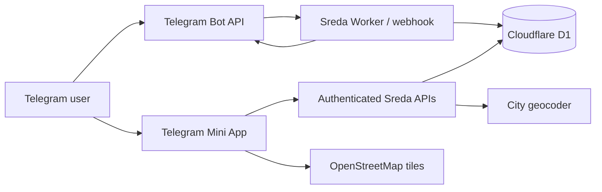

# Sreda Community Map

[](https://github.com/alexeypetrov88/sreda-community-map/actions/workflows/ci.yml)
[](LICENSE)

Sreda Community Map is an open-source Telegram Mini App and companion bot for
the Sreda community. It helps members find one another by city: they can share
a home city, record a current trip, schedule future trips, inspect a date-aware
map, and ask who will be in a city on selected dates.

The interface is intentionally structured: buttons, city search, and date
pickers. There is no LLM, natural-language parser, live GPS tracking, or
free-form location field.


> **Project status:** 1.0. The release includes server-owned city records,
> expiring one-time approval decisions, durable revocation, request throttling,
> audit events, self-service deletion, and automated authentication tests.

## Product behaviour

- A new member follows the private Sreda invitation link and becomes `pending`.
- Finding the bot or pressing **Start** without that invitation cannot create a
  membership request.
- A configured admin receives **Approve** and **Reject** buttons. Production
  deployments should use immutable numeric IDs; staging can bootstrap its first
  admin from a username and then pin that account's numeric Telegram identity.
- Approved members open the Mini App from the bot.
- A member can set or change a country-and-city-level home location.
- **I’m travelling now** creates a trip beginning today.
- **Plan a future trip** records a city and inclusive start/end dates.
- Members can list their plans and cancel one with a two-step button.
- Members can remove their home city or permanently delete their own profile
  and trips.
- The map can be moved into the future one day at a time or by date picker.
- Travellers use a different map colour from members at home.
- **Who is here today?** and date-range search return matching members.
- Overlapping trips for the same member are rejected to avoid ambiguous
  locations.
- Admins can list pending, active, and inactive members in Telegram and revoke
  or restore access using buttons.

All approved members currently have the same visibility: they can see the
display name and city-level presence of every other approved member.

## Architecture



The bot and Mini App share one Cloudflare-compatible Worker:

- **Telegram webhook** handles membership requests and admin decisions.
- **Mini App frontend** provides map, plans, and presence search.
- **API routes** verify Telegram `initData` and approved membership on every
  request.
- **D1/SQLite** stores members, home locations, trips, and city-search cache.
- **Nominatim-compatible geocoder** resolves an explicitly submitted city
  search; it is not used for autocomplete.

See [Architecture](docs/architecture.md) and
[Privacy and threat model](docs/privacy-and-threat-model.md) for detail.

## Data stored

| Data | Stored |
|---|---|
| Telegram numeric ID | Yes |
| Telegram name and optional username | Yes |
| Membership and approval status | Yes |
| Canonical home city and country | Optional |
| Canonical trip city, country and dates | Optional |
| Exact address or live GPS | No |
| Phone number or Telegram chat history | No |
| Free-form travel notes | No |

Coordinates are created only from server-side geocoder results and represent a
city centroid, not a person’s physical position. Location-write APIs accept a
server-issued place ID and never accept browser-supplied coordinates.

## Security boundary

The deployed root page may be publicly reachable because Telegram needs an
HTTPS Mini App URL. Community data is not public:

1. the browser sends Telegram’s signed `initData`;
2. the server verifies its HMAC with `BOT_TOKEN`;
3. the session must be fresh;
4. the Telegram ID must have `approved` status;
5. mutations are scoped to the authenticated member.
6. API responses are non-cacheable and requests are rate-limited.

The Telegram ID in browser state is never trusted without signature
verification. The webhook separately checks
`X-Telegram-Bot-Api-Secret-Token`.

## Requirements

- Node.js 22.13 or newer
- A Telegram bot created with [BotFather](https://t.me/BotFather)
- Cloudflare-compatible Worker hosting with a D1 binding named `DB`, or
  ChatGPT Sites with D1 enabled
- At least one numeric Telegram admin ID, or a staging admin username for the
  one-time identity bootstrap

## Environment

Copy `.env.example` to `.env.local` for local work:

```bash
cp .env.example .env.local
```

| Variable | Required | Purpose |
|---|---:|---|
| `BOT_TOKEN` | Yes | BotFather token; also verifies Mini App sessions |
| `SREDA_ADMIN_IDS` | Conditional | Comma-separated immutable Telegram numeric IDs (preferred for production) |
| `SREDA_ADMIN_USERNAMES` | Conditional | Usernames used only to bootstrap the first admin, then pinned to that account's numeric ID |
| `SREDA_APP_URL` | Yes | Canonical HTTPS Mini App URL used in bot buttons |
| `SREDA_JOIN_CODE` | Yes | Private random value carried by Sreda’s Telegram invitation link |
| `TELEGRAM_WEBHOOK_SECRET` | Yes | Authenticates webhook requests |
| `GEOCODER_CONTACT` | For public Nominatim | Identifies the application operator |
| `GEOCODER_URL` | No | Replaces the default Nominatim-compatible endpoint |

Never commit real values. `BOT_TOKEN`, `SREDA_JOIN_CODE`, and
`TELEGRAM_WEBHOOK_SECRET` must be stored as hosting secrets.

## Local development

```bash
npm install
npm run db:generate
npm run dev
```

The normal browser view shows a locked splash screen. Full API testing requires
valid Telegram Mini App `initData` or purpose-built test fixtures; production
must never include an authentication bypass.

Validation:

```bash
npm run lint
npm run typecheck
npm test
npm run audit:prod
```

## Deployment

Read [Deployment and Telegram setup](docs/deployment.md).

At a high level:

1. create the D1 database and apply `drizzle/` migrations;
2. configure runtime secrets and admin IDs;
3. deploy to an HTTPS URL;
4. register `/api/telegram` as the Telegram webhook;
5. configure the root URL as the bot’s Main Mini App;
6. test pending, approval, home, trip, cancellation, map and search flows with
   separate admin and member accounts.

The checked-in `.openai/hosting.json` contains the original project’s opaque
Sites ID. Fork maintainers should remove `project_id` before creating their own
Site.

## Geocoding and map policy

The default public Nominatim endpoint is suitable only for a small community.
Searches occur only after **Find** is pressed and results are cached. Operators
must obey its aggregate request limits, provide identifying contact
information, and switch to a hosted provider or self-hosted instance as usage
grows.

OpenStreetMap attribution remains visible on the map.

## Post-1.0 roadmap

- Per-member visibility preferences
- Operator-facing audit viewer and retention automation
- Optional private Google Sheets export for administrators
- Localization and an accessible non-map list view

## Contributing

Issues and pull requests are welcome. Read [CONTRIBUTING.md](CONTRIBUTING.md)
and [SECURITY.md](SECURITY.md) first. Please do not put real community data,
Telegram tokens, or personal identifiers in issues or test fixtures.

## Licence

[MIT](LICENSE)
